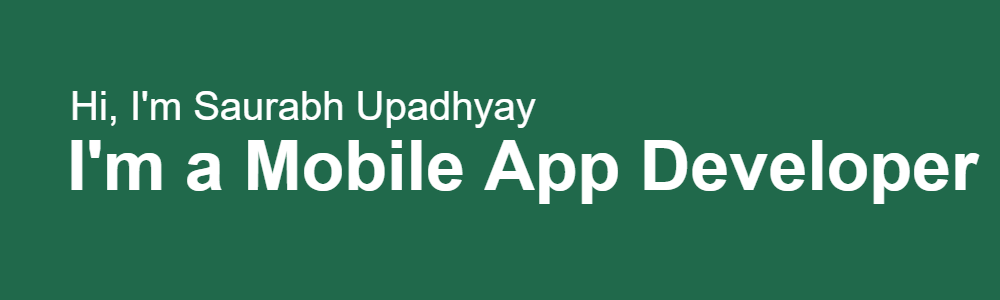

## My favorite tools and technologies ⚙️

> Tools and technologies that I have worked with and am interested in
<table>
  <!-- Programming Languages -->
  <tr>
    <td align="center" width="96">
      
       Dart
    </td>
    <td class="skill-cell" align="center" width="96">
      
       Flutter
    </td>
    <td class="skill-cell" align="center" width="96">
      
       Java
    </td>
    <td class="skill-cell" align="center" width="96">
      
       Java
    </td>
    <td align="center" width="96">
      
       HTML
    </td>
    <td class="skill-cell" align="center" width="96">
      
       CSS
    </td>
    <td class="skill-cell" align="center" width="96">
      
       JavaScript
    </td>
        <td class="skill-cell" align="center" width="96">
      
       Angular
    </td>
    <td align="center" width="96">
      
       TypeScript
    </td>
  </tr>
  <!-- Existing tools -->
  <tr>
    <td class="skill-cell" align="center" width="96">
      
       Android Studio
    </td>
    <td class="skill-cell" align="center" width="96">
      
       Xcode
    </td>
    <td class="skill-cell" align="center" width="96">
      
       Eclipse
    </td>
    <td class="skill-cell" align="center" width="96">
      
       Figma
    </td>
    <td class="skill-cell" align="center" width="96">
      
       Firebase
    </td>
    <td class="skill-cell" align="center" width="96">
      
       GitHub
    </td>
    <td class="skill-cell" align="center" width="96">
      
       npm
    </td>
    <td class="skill-cell" align="center" width="96">
      
       Postman
    </td>
    <td class="skill-cell" align="center" width="96">
      
       VSCode
    </td>
  </tr>
</table>

